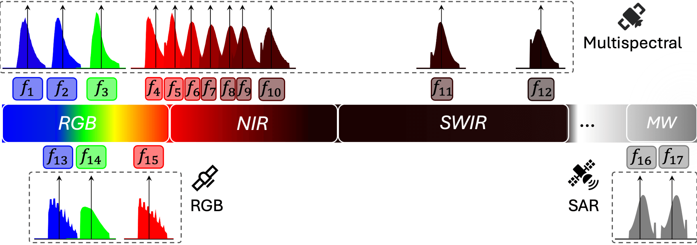
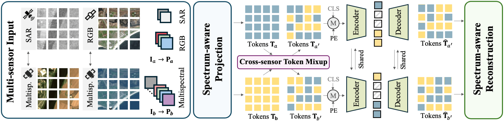

<p align="center">
  
</p>

# Spectrum-Aware Multi-Sensor Auto-Encoder for Remote Sensing Images
[](https://arxiv.org/abs/2506.19585)
[](https://huggingface.co/collections/gsumbul/smarties-685888bb5ecded3f802cc945)
[](https://opensource.org/licenses/Apache-2.0)


[](https://gsumbul.github.io/SMARTIES/)

**News:**
 - [25/06/2025] [arXiv pre-print](https://arxiv.org/abs/2506.19585) and [model weights](https://huggingface.co/collections/gsumbul/smarties-685888bb5ecded3f802cc945) are out!

## 🚀 Introduction

<!-- Spectral coverage figure -->
<p align="center">
  
</p>

From optical sensors to microwave radars, leveraging the complementary strengths of remote sensing (RS) sensors is crucial for achieving dense spatio-temporal monitoring of our planet, but recent foundation models (FMs) are often specific to single sensors or to fixed combinations. 

SMARTIES is a generic and versatile FM lifting sensor-dependent efforts and enabling scalability and generalization to diverse RS sensors: SMARTIES projects data from heterogeneous sensors into a shared spectrum-aware space, enabling the use of arbitrary combinations of bands both for training and inference. To obtain sensor-agnostic representations, SMARTIES was trained as a single, unified transformer model reconstructing masked multi-sensor data with cross-sensor token mixup, while modulating its feature representations to accept diverse sensors as input.

The details of SMARTIES are described in our paper, available on [arXiv](https://arxiv.org/abs/2506.19585). The model weights of SMARTIES based on ViT-B and ViT-L encoders are available at our [ Hugging Face Collection](https://huggingface.co/collections/gsumbul/smarties-685888bb5ecded3f802cc945).

**Direct links to pretrained models:**
- [SMARTIES (ViT-B)](https://huggingface.co/gsumbul/SMARTIES-v1-ViT-B/blob/main/smarties-v1-vitb.safetensors)
- [SMARTIES (ViT-L)](https://huggingface.co/gsumbul/SMARTIES-v1-ViT-L/blob/main/smarties-v1-vitl.safetensors)


## ✨ Key Features
- 🛰️ **Multi-Sensor Representations:** SMARTIES enables sensor-agnostic processing of Earth observation data, including optical (e.g., Sentinel-2), radar (e.g., Sentinel-1), and sub-meter resolution RGB (e.g., Maxar) imagery and unseen ones in a zero-shot manner.
- 🌈 **Spectrum-Aware Projections:** SMARTIES projects data from heterogeneous sensors into a shared spectrum-aware space: given a specific sensor, each one of its bands is projected by projection layers specific to wavelength ranges.
- ⚡ **Lightweight and Scalable:** SMARTIES is designed to be lightweight and scalable, making it suitable for a wide range of remote sensing applications.
- 🔀 **Flexible Band Combinations:** SMARTIES can handle arbitrary combinations of spectral bands from different sensors, enabling flexible remote sensing applications.
- 🔄 **Downstream Transfer:** SMARTIES enables downstream transfer using a unified model across a diverse set of sensors and tasks, including scene classification, semantic segmentation, and multi-label classification.

<!-- Model architecture figure -->
<p align="center">
  
</p>

## ⚙️ Installation

This codebase can be run either using a Python virtual environment or Docker. All dependencies are listed in `requirements.txt`. The codebase has been tested with **Python 3.10**.

- **Option 1: Python Virtual Environment**
  1. Clone this repository.
  2. (Recommended) Create and activate a Python 3.10 virtual environment.
  3. Install dependencies:
     ```bash
     pip install -r requirements.txt
     ```

- **Option 2: Docker**
  - A [`Dockerfile`](Dockerfile) is provided for reproducible environments. Build and run the container as needed.

### 📝 Experiment Logging (wandb)
This codebase uses [Weights & Biases (wandb)](https://wandb.ai/) for experiment tracking and logging by default. **Make sure to set the `--wandb_entity` argument to your own wandb username** to ensure your experiment logs are saved to your account. Otherwise, logs may be sent to the default entity or not be accessible to you.

Example usage:
```bash
python main_pretrain.py \
    ... \
    --wandb_entity <your_wandb_username>
```

### 🖥️ Multi-GPU and Distributed Training
This codebase uses [Hugging Face Accelerate](https://github.com/huggingface/accelerate) for easy multi-node and multi-GPU training. To enable distributed training, set the following flags:
- `--multi_gpu` to enable multi-GPU/distributed mode
- `--num_machines` to specify the number of nodes (machines)
- `--num_processes` to specify the number of processes (GPUs per node)

Example (multi-node, multi-GPU):
```bash
accelerate launch \
    --multi_gpu \
    --num_machines 2 \
    --num_processes 8 \
    main_pretrain.py ...
```
If you want to run on a single GPU, you can simply use:
```bash
python main_pretrain.py ...
```

### 📦 Data Preparation
Download and extract the evaluation and pretraining datasets using the provided script:

```bash
bash scripts/download_data.sh
```

> ⚠️ **Warning:** This will download all the datasets, that will take up a big space in your disk. You can selectively download only the datasets you need by modifying the script.

## 🏋️‍♂️ Pretraining

To pretrain SMARTIES on multi-sensor RS data:

You can use the provided scripts for quick setup:
- `scripts/pretrain_vitb.sh` for ViT-B
- `scripts/pretrain_vitl.sh` for ViT-L

Or run manually:

```bash
python main_pretrain.py \
    --model smarties_vit_base_patch16 \
    --input_size 224 \
    --patch_size 16 \
    --batch_size 512 \
    --epochs 300 \
    --spectrum_specs_path config/electromagnetic_spectrum.yaml \
    --sensors_specs_path config/pretraining_sensors.yaml \
    --eval_specs_path config/eval_datasets.yaml \
    --wandb_project SMARTIES \
    --out_dir weights
```

See `utils/arguments.py` for all available options.

## 📊 Downstream Transfer, Evaluation and Reproducibility

Most of the results reported in the SMARTIES paper are reproducible using the provided linear probed or fine-tuned model weights, which are accessible through our [ Hugging Face Collection](https://huggingface.co/collections/gsumbul/smarties-685888bb5ecded3f802cc945). Evaluation scripts for each dataset are available under the `scripts/` directory. 

- You can use the fine-tuned model weights directly with the `--eval_only` flag for evaluation.
- Alternatively, you can perform fine-tuning or linear probing starting from the pretrained model weights.

### 📋 Evaluation Table

| Dataset         | Task                    | Evaluation Type   | Sensor(s) Used           | Finetuned Model Weights |
|-----------------|-------------------------|-------------------|--------------------------|-------------|
| BigEarthNetS2   | Multi-label Classification | Fine-tuning   | Sentinel-2               | [ViT-B](https://huggingface.co/gsumbul/SMARTIES-v1-finetuned-models/blob/main/smarties-v1-vitb-bigearthnets2-finetune.safetensors) [ViT-L](https://huggingface.co/gsumbul/SMARTIES-v1-finetuned-models/blob/main/smarties-v1-vitl-bigearthnets2-finetune.safetensors)|
| BigEarthNetS1   | Multi-label Classification | Linear Probing    | Sentinel-1               | [ViT-B](https://huggingface.co/gsumbul/SMARTIES-v1-finetuned-models/blob/main/smarties-v1-vitb-bigearthnets1-linprobe.safetensors) [ViT-L](https://huggingface.co/gsumbul/SMARTIES-v1-finetuned-models/blob/main/smarties-v1-vitl-bigearthnets1-linprobe.safetensors) |
| BigEarthNetMM   | Multi-Modal Multi-label Classification | Linear Probing    | Sentinel-1, Sentinel-2  | [ViT-B](https://huggingface.co/gsumbul/SMARTIES-v1-finetuned-models/blob/main/smarties-v1-vitb-bigearthnetmm-linprobe.safetensors) [ViT-L](https://huggingface.co/gsumbul/SMARTIES-v1-finetuned-models/blob/main/smarties-v1-vitl-bigearthnetmm-linprobe.safetensors) |
| EuroSAT         | Scene Classification    | Fine-tuning    | Sentinel-2               | [ViT-B](https://huggingface.co/gsumbul/SMARTIES-v1-finetuned-models/blob/main/smarties-v1-vitb-eurosat-finetune.safetensors) [ViT-L](https://huggingface.co/gsumbul/SMARTIES-v1-finetuned-models/blob/main/smarties-v1-vitl-eurosat-finetune.safetensors)|
| EuroSAT         | Scene Classification    | Linear Probing    | Sentinel-2               | [ViT-B](https://huggingface.co/gsumbul/SMARTIES-v1-finetuned-models/blob/main/smarties-v1-vitb-eurosat-linprobe.safetensors) [ViT-L](https://huggingface.co/gsumbul/SMARTIES-v1-finetuned-models/blob/main/smarties-v1-vitl-eurosat-linprobe.safetensors) |
| EuroSAT         | Scene Classification    | kNN    | Sentinel-2               | * |
| RESISC-45         | Scene Classification    | Fine-tuning    | RGB               | [ViT-L](https://huggingface.co/gsumbul/SMARTIES-v1-finetuned-models/blob/main/smarties-v1-vitl-resisc45-finetune.safetensors) |
| WHU-RS19        | Scene Classification    | kNN    | RGB                      | * |
| UC-Merced       | Scene Classification    | kNN    | RGB                      | * |
| BurnScars         | Semantic Segmentation    | UPerNet Probing    | HLS               | ** |
| DynamicEarthNet         | Semantic Segmentation    | UPerNet Probing    | Planet               | ** |
| SpaceNet7         | Semantic Segmentation    | UPerNet Probing    | Planet               | ** |
| SICKLE         | Semantic Segmentation    |  Non-linear Probing   | Landsat-8 (OLI, TIRS)               | Coming soon |
| DFC2020         | Multi-Modal Semantic Segmentation    | Non-linear Probing    | Sentinel-1, Sentinel-2               | [ViT-B](https://huggingface.co/gsumbul/SMARTIES-v1-finetuned-models/blob/main/smarties-v1-vitb-dfc2020-linprobe.safetensors) |

*kNN eval can be run directly (e.g., `bash scripts/kNN_EuroSAT_vitb.sh`)

**SMARTIES will be part of the PANGAEA benchmark soon that will allow reproducibility under the codebase of PANGAEA.

## 🧩 Using SMARTIES

SMARTIES is designed to be flexible and can be easily adapted to new datasets and sensors. A Jupyter notebook will be provided soon how to use pretrained model weights independently from this codebase. To use SMARTIES with a new dataset within this codebase, follow these steps:

1. **Create a Data Loader**
   - Use the `SmartiesVisionTransformer` model in `models_smarties_vit.py`.
   - Your data loader should provide either patchified or unpatchified image tensors. The model's `forward` method accepts an `is_patchify` argument:
     - If `is_patchify=True`, the model expects patchified input (shape: `[B, H, W, C, patch_h, patch_w]`).
     - If `is_patchify=False`, the model will internally patchify the input.

2. **Update Dataset Configuration**
   - Add your new dataset to `config/eval_datasets.yaml`.
   - For each dataset, specify:
     - `root_path`: Path to your dataset.
     - `train_img_list` and `val_img_list`: Lists of training and validation images.
     - `sensor_specs`: Must include `bands`, which is a list of spectrum ranges from predefined ones in `config/electromagnetic_spectrum.yaml` that will be used by your dataset. It also includes `selected_bands`, which is a list of band indices you want to use from the `bands` list (i.e., flexible band selection).
   - Example:
     ```yaml
     MyDataset:
       root_path: data/MyDataset/
       train_img_list: eval_splits/MyDataset-train.txt
       val_img_list: eval_splits/MyDataset-val.txt
       sensor_specs:
         bands: [red_1, green_1, blue_3]
         selected_bands: [0, 1, 2]
         # Optionally, add normalization stats (mean, std, percentiles)
     ```

3. **Band Mapping and Electromagnetic Spectrum**
   - The `bands` field in your dataset config should correspond to the predefined spectral ranges in `config/electromagnetic_spectrum.yaml`. If not `electromagnetic_spectrum.yaml` can be modified to include your custom bands.
   - Each entry in `electromagnetic_spectrum.yaml` defines the properties of a range in the electromagnetic spectrum (e.g., wavelength, sensor, name, projection index).
   - This mapping ensures that the model knows how to process each band in your dataset and align it with the correct projection function.

4. **Run SMARTIES**
   - Use your updated config and data loader to finetune or evaluate SMARTIES on your new dataset.
   - Example:
     ```bash
     python main_downstream.py \
         --eval_dataset MyDataset \
         --spectrum_specs_path config/electromagnetic_spectrum.yaml \
         --eval_specs_path config/eval_datasets.yaml \
         ...
     ```

## 🛠️ Configuration Files
- `config/electromagnetic_spectrum.yaml`: Defines ranges in the electromagnetic spectrum and their properties.
- `config/eval_datasets.yaml`: Specifies evaluation datasets, their statistics and mapping of their bands to the predefined ranges in the electromagnetic spectrum.
- `config/pretraining_sensors.yaml`: Sensor-specific configuration for pretraining with a similar format to `eval_datasets.yaml`.

## 📣 Attribution
If you use SMARTIES, please cite the paper:

```
@article{smarties,
  title={{SMARTIES}: Spectrum-Aware Multi-Sensor Auto-Encoder for Remote Sensing Images},
  author={Gencer Sumbul and Chang Xu and Emanuele Dalsasso and Devis Tuia},
  journal={arXiv preprint arXiv:2506.19585},
  year={2025}
}
```

## 📄 License
This repository is released under the Apache v2 License.

## 🙏 Acknowledgements
This codebase is built using components from [timm](https://github.com/huggingface/pytorch-image-models), [TerraTorch](https://ibm.github.io/terratorch/stable/) and [Accelerator](https://huggingface.co/docs/accelerate/en/package_reference/accelerator).

SMARTIES is supported by the European Space Agency (ESA) through the Discovery and Preparation Program, and is part of the project Toward a Foundation Model for Multi-Sensor Earth Observation Data with Language Semantics.

